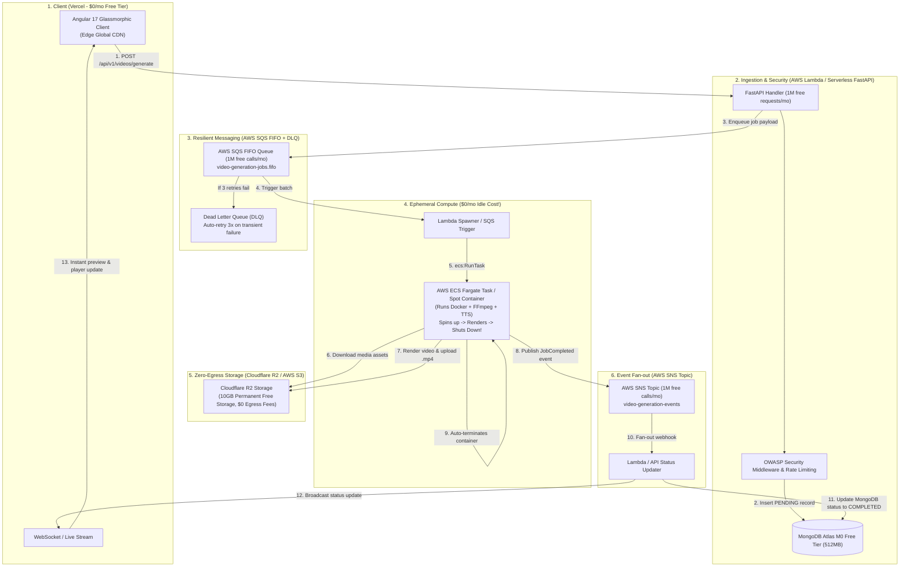

# 🎬 VidGen Studio — Full Stack Autonomous AI Video Platform

An enterprise-grade, event-driven AI video creation platform that transforms text prompts, research papers, and URLs into scene-level structured scripts, multi-voice character acting, synchronized multimodal assets, and cinematic videos at **$0/month baseline idle cost**.


---

## 🏛️ Event-Driven Zero-Cost Cloud Architecture



---

## 💰 Zero-Cost Free-Tier Financial Breakdown

| Component | Cloud Provider | Free Tier Allowance | Idle / Monthly Cost |
| :--- | :--- | :--- | :--- |
| **Frontend Client** | **Vercel** | 100GB bandwidth, automatic SSL, preview deploys | **$0.00 / month** |
| **API & Auth** | **AWS Lambda** | 1,000,000 requests/mo forever + 3.2M seconds compute | **$0.00 / month** |
| **Database** | **MongoDB Atlas** | M0 Shared Cluster: 512MB RAM/Storage, TLS 1.3 encrypted | **$0.00 / month** |
| **Job Queue** | **AWS SQS** | 1,000,000 requests/mo forever + FIFO delivery | **$0.00 / month** |
| **Notifications** | **AWS SNS** | 1,000,000 publish/delivery calls/month free forever | **$0.00 / month** |
| **Media Storage** | **Cloudflare R2** | 10 GB storage free, **$0.00 egress bandwidth fees** | **$0.00 / month** |
| **FFmpeg Rendering** | **AWS ECS Fargate Spot / GCP Cloud Run** | On-demand compute (~$0.0006 per 60s video) / GCP 180k vCPU-s free | **$0.00 idle (cents per render)** |

---

## 🛡️ Complete Enterprise Security Stack (OWASP Top 10)

- **Security Headers Middleware**: Enforces HSTS (1 year), Content Security Policy (CSP), `X-Frame-Options: DENY`, `X-Content-Type-Options: nosniff`, and restricted `Permissions-Policy`.
- **SSRF Defense (`validate_safe_url`)**: Disallows requests to localhost (`127.0.0.1`), cloud instance metadata endpoints (`169.254.169.254`), and private RFC1918 subnets.
- **Rate Limiting**: In-memory IP rate limiter on sensitive endpoints (`/auth/login`, `/auth/register`) preventing credential stuffing and brute-force attacks.
- **Strict Access Control**: Eliminated arbitrary development bypasses in production environments; all ObjectId strings strictly validated.
- **Safe CORS Policy**: Dynamically restricts origins to `ALLOWED_ORIGINS` in production while allowing seamless local and preview testing.
- **Input Sanitization**: Control character and null-byte stripping with bounded topic and prompt lengths.

---

## 🤖 OpenCode & Meta Muse Agent Delegation

To delegate coding and maintenance tasks without consuming primary conversational tokens, use the pre-configured local CLI tools:

### 1. OpenCode Autonomous Agent
```powershell
# Run OpenCode with free models (no payment required)
opencode run --model opencode/muse-spark-1.3-contributor-free "Refactor component styles"

# Or start interactive TUI
opencode
```

### 2. Meta Muse Code Agent
```powershell
# Run task using Meta Muse CLI
$env:Path = "C:\Users\vaibh\AppData\Local\Programs\muse;$env:Path"
muse exec --trust-workspace "Review and audit test coverage"
```

---

## 🚀 Local Development Setup

### Backend (FastAPI)
```bash
cd backend
python -m venv venv
venv\Scripts\activate
pip install -r requirements.txt
uvicorn app.main:app --reload --port 8000
```

### Frontend (Angular 17)
```bash
cd frontend
npm install
npm run start
```
Frontend will be running at `http://localhost:4200` with the glassmorphism Studio UI.
