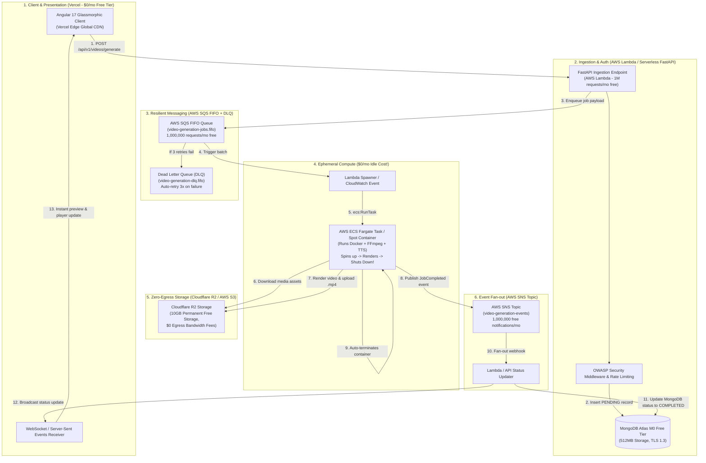

# 🏛️ Zero-Cost Cloud Architecture Blueprint & Deployment Guide

This document describes the enterprise-grade, event-driven, decoupled cloud architecture designed to run the **VidGen AI Platform** at **$0/month baseline idle cost**.

---

## 📐 System Architecture Diagram



---

## 💰 Zero-Cost Free-Tier Financial Breakdown

| Component | Cloud Provider | Free Tier Allowance | Our Usage & Idle Cost |
| :--- | :--- | :--- | :--- |
| **Frontend Client** | **Vercel** | Hobby Tier: 100GB bandwidth, unlimited previews, automatic HTTPS | **$0.00 / month** |
| **API & Auth** | **AWS Lambda** | 1,000,000 requests/month forever + 3,200,000 seconds compute | **$0.00 / month** |
| **Database** | **MongoDB Atlas** | M0 Shared Cluster: 512MB RAM/Storage, TLS 1.3 encrypted | **$0.00 / month** |
| **Job Queue** | **AWS SQS** | 1,000,000 requests/month forever + FIFO delivery | **$0.00 / month** |
| **Notifications** | **AWS SNS** | 1,000,000 publish/delivery calls/month free forever | **$0.00 / month** |
| **Media Storage** | **Cloudflare R2** | 10 GB storage free, **$0.00 egress bandwidth fees** | **$0.00 / month** |
| **FFmpeg Rendering** | **AWS ECS Fargate Spot / GCP Cloud Run** | On-demand spot compute (~$0.0006 per 60s video) / GCP 180k vCPU-s free | **$0.00 idle (cents per render)** |

---

## 🛡️ Enterprise Security Stack Checklist (OWASP Top 10)

1. **A01: Broken Access Control**: Strict ObjectId verification, eliminated insecure dev bypasses in production environments.
2. **A02: Cryptographic Failures**: JWT access tokens (HS256) with 30-minute expiration, password hashing with bcrypt, and HSTS response headers.
3. **A03: Injection**: Pydantic v2 input validation, regex sanitization of control characters, and typed parameters preventing NoSQL injection.
4. **A04: Insecure Design & SSRF**: `validate_safe_url()` blocks loopback (`127.0.0.1`), link-local metadata endpoints (`169.254.169.254`), and private RFC1918 subnets.
5. **A05: Security Misconfiguration**: Configurable `ALLOWED_ORIGINS` CORS headers, strict CSP policies, and `X-Frame-Options: DENY`.
6. **A06: Vulnerable Components**: Updated dependencies with pinned semantic version ranges.
7. **A07: Identification & Auth**: In-memory IP rate limiting (`SimpleRateLimiter`) on `/auth/login` and `/auth/register` to prevent credential stuffing.
8. **A08: Software & Data Integrity**: S3 pre-signed URLs and SQS FIFO deduplication prevents replayed or poisoned job submissions.
9. **A09: Security Logging**: Structured logging without exposing bearer tokens or API credentials.
10. **A10: Path Traversal**: Strict path resolution guarding static video directories.

---

## 🚀 Step-by-Step Deployment Guide

### 1. Frontend (Vercel)
```bash
cd frontend
npm install
npm run build
# Deploy with Vercel CLI
npx vercel deploy --prod
```

### 2. Container Image (AWS ECR)
```bash
# Authenticate Docker to AWS ECR
aws ecr get-login-password --region us-east-1 | docker login --username AWS --password-stdin <YOUR_AWS_ACCOUNT_ID>.dkr.ecr.us-east-1.amazonaws.com

# Build and push worker container
docker build -t video-generator-worker -f deploy/Dockerfile.worker .
docker tag video-generator-worker:latest <YOUR_AWS_ACCOUNT_ID>.dkr.ecr.us-east-1.amazonaws.com/video-generator-worker:latest
docker push <YOUR_AWS_ACCOUNT_ID>.dkr.ecr.us-east-1.amazonaws.com/video-generator-worker:latest
```

### 3. AWS Resources Setup
1. **Create SQS FIFO Queue**:
   ```bash
   aws sqs create-queue \
     --queue-name video-generation-jobs.fifo \
     --attributes FifoQueue=true,ContentBasedDeduplication=true
   ```
2. **Create SNS Topic**:
   ```bash
   aws sns create-topic --name video-generation-events
   ```
3. **Configure Environment Variables**:
   In AWS Lambda or your production `.env`:
   ```ini
   ENVIRONMENT=production
   STORAGE_BACKEND=r2
   S3_BUCKET_NAME=my-video-bucket
   S3_ENDPOINT_URL=https://<account_id>.r2.cloudflarestorage.com
   QUEUE_BACKEND=sqs
   SQS_QUEUE_URL=https://sqs.us-east-1.amazonaws.com/<account_id>/video-generation-jobs.fifo
   SNS_TOPIC_ARN=arn:aws:sns:us-east-1:<account_id>:video-generation-events
   ```

---

## 🎙️ Voice Cloning: On-Demand Sidecar vs Standalone Microservice

You can run the free local voice cloning service (`services/voice_cloner/`) using two flexible zero-subscription patterns:

### Pattern A: Sidecar on the SAME ECS Fargate Task ($0 Idle Cost!)
In AWS ECS Fargate, a single Task Definition can host multiple containers that communicate over `localhost`.

```json
{
  "family": "video-renderer-task",
  "networkMode": "awsvpc",
  "requiresCompatibilities": ["FARGATE"],
  "cpu": "2048",
  "memory": "4096",
  "containerDefinitions": [
    {
      "name": "voice-cloner",
      "image": "<ACCOUNT_ID>.dkr.ecr.us-east-1.amazonaws.com/vidgen-voice-cloner:latest",
      "essential": false,
      "portMappings": [{"containerPort": 8004, "hostPort": 8004}]
    },
    {
      "name": "video-renderer",
      "image": "<ACCOUNT_ID>.dkr.ecr.us-east-1.amazonaws.com/video-generator-worker:latest",
      "essential": true,
      "environment": [
        {"name": "CHATTERBOX_BASE_URL", "value": "http://127.0.0.1:8004"}
      ]
    }
  ]
}
```
**Benefits:**
1. **Zero Idle Billing**: Both containers spin up simultaneously when an SQS video job arrives.
2. **Instant Localhost Speed**: The worker requests cloned speech via `http://127.0.0.1:8004/tts` with 0 network latency.
3. **Auto-Shutdown**: When `video-renderer` finishes, the entire ECS task terminates, costing **$0.00 while idle**.

### Pattern B: Local 1-Click Docker Service
Run the voice cloner microservice on your local workstation with GPU or CPU:
```bash
cd services/voice_cloner
docker compose up -d
```
The server will be available at `http://localhost:8004`. All character voices (`peter_voice.wav`, `brian_voice.wav`, `stewie_voice.wav`) are automatically mapped and pre-loaded.

